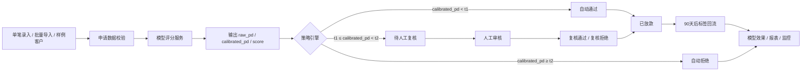
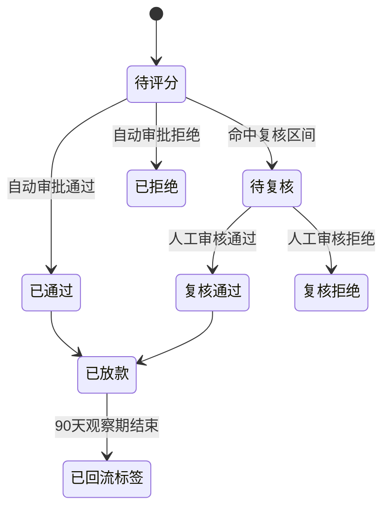
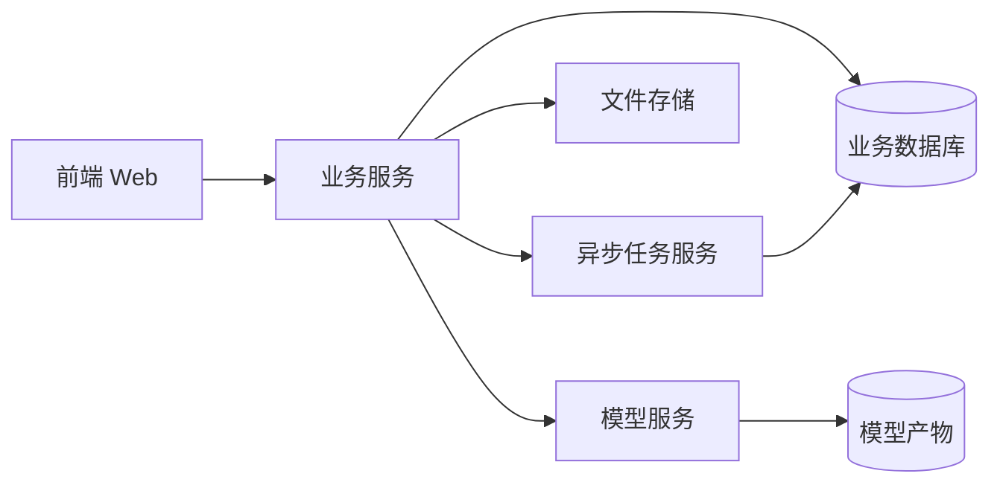

# 信用风控评分平台 PRD

## 1. 文档信息
| 项目 | 内容 |
| --- | --- |
| 产品名称 | 信用风控评分平台 |
| 产品定位 | 面向风控负责人的通用个人信贷审批平台，模拟离线信用评分模型上线后的真实业务系统 |
| 文档版本 | V1.0 |
| 当前状态 | 可进入原型设计与开发拆解 |
| 核心目标 | 将离线信用评分模型能力产品化，形成“申请接入—模型评分—策略决策—人工复核—标签回流—监控报表”的业务闭环 |
| 目标用户 | 风控负责人、风控运营人员、人工审核人员、模型分析人员（V1 不区分权限角色） |
| 产品形态 | 风控经营大屏 + 业务后台操作台 |
| 业务场景 | 通用个人信贷审批 |

---

# 2. 背景与问题定义

## 2.1 项目背景
当前已有一套基于 Home Credit 数据集训练的信用风控评分模型工程，已完成多表特征工程、模型训练、融合搜索、概率校准、风险分映射、阈值优化和离线效果评估。模型当前可输出：

- `raw_pd`：模型原始违约概率
- `calibrated_pd`：校准后的违约概率
- `score`：300–900 风险分
- `decision_band`：`approve` / `review` / `reject`

离线模型当前主口径结果：

| 指标 | 当前值 |
| --- | ---: |
| ROC-AUC | 0.7876 |
| KS | 0.4345 |
| LogLoss | 0.2364 |
| Brier Score | 0.0656 |
| 最高风险十分位坏账率 | 30.65% |
| 最高风险十分位 Lift | 3.80x |
| 最终策略 | `xgboost_only` |
| 默认三段式阈值 | `t1 = 0.14`, `t2 = 0.42` |

当前模型工程已经具备离线建模闭环，但尚未被包装为可供业务理解、操作和演示的产品系统。因此，需要设计一个信用风控评分平台，将模型结果模拟上线到真实审批流程中。

## 2.2 当前痛点
| 痛点 | 说明 |
| --- | --- |
| 模型结果停留在离线 artifact | 业务人员只能看到指标和文件，无法直观看到模型如何参与审批 |
| 缺少完整业务闭环 | 目前缺少申请接入、评分、审批分流、人工复核、标签回流、监控报表等产品化能力 |
| 风控策略不可交互 | 当前阈值和成本矩阵仅存在于离线报告中，无法通过页面模拟策略调整影响 |
| 模型解释不够业务化 | SHAP 特征重要性存在，但缺乏对单笔客户的可读原因码与解释视图 |
| 缺少“上线后”视角 | 真实系统不仅要看模型指标，还要看通过率、复核率、拒绝率、待复核积压、PSI/CSI、分数分布漂移等运营指标 |

## 2.3 产品目标
### 2.3.1 业务目标
1. 展示信用评分模型上线后如何辅助审批决策。
2. 将自动审批与人工复核串联成完整闭环。
3. 支持策略阈值试算、成本矩阵调整和策略版本发布。
4. 支持标签回流后的模型效果评估和业务效果监控。

### 2.3.2 产品目标
1. 让风控负责人能够在 3 分钟内理解当前风险水平、审批结构和策略效果。
2. 让业务操作人员能够完成单笔申请录入、批量评分、人工复核和历史查询。
3. 让模型分析人员能够查看模型版本、效果、校准、Lift、SHAP 和稳定性。
4. 让策略人员能够在不改代码的情况下模拟阈值变化对审批结果的影响。

### 2.3.3 非目标
V1 暂不覆盖以下能力：
- 真实资金放款系统对接
- 复杂权限体系
- 贷中/贷后预警
- 自动化模型重训
- 多模型 A/B 流量路由
- 外部征信真实接口接入
- 真实授信额度计算

---

# 3. 用户与使用场景

## 3.1 核心用户
| 用户 | 主要诉求 |
| --- | --- |
| 风控负责人 | 看整体经营、风险结构、审批策略效果、模型稳定性 |
| 风控运营人员 | 批量查看申请结果、识别高风险客户、导出报表 |
| 人工审核人员 | 处理待复核申请、查看客户画像、给出复核结论 |
| 模型分析人员 | 查看模型效果、SHAP、Lift、校准、漂移指标 |

> V1 版本不做权限隔离，所有页面默认可见；为后续扩展预留角色字段与审计能力。

## 3.2 典型使用场景
### 场景 1：风控负责人查看今日经营情况
- 进入风控总览
- 查看今日申请量、自动通过率、人工复核率、自动拒绝率
- 查看高风险申请占比、待复核积压量、策略预警、模型漂移预警
- 如发现复核率异常升高，可进入策略中心查看当前阈值效果

### 场景 2：业务人员录入单笔申请
- 进入申请审批 > 新建申请
- 按分步表单录入客户信息
- 提交后调用模型评分接口
- 系统返回风险分、PD、审批结论、原因码和解释视图
- 自动流转至对应状态

### 场景 3：人工审核中间风险客户
- 进入人工复核工作台
- 查看待复核列表
- 打开申请详情，查看客户全景画像、模型结论、正负向影响因素
- 人工给出“复核通过”或“复核拒绝”结论

### 场景 4：策略人员模拟阈值调整
- 进入策略中心
- 调整 `t1`、`t2` 与成本矩阵
- 系统基于历史样本试算通过率、复核率、拒绝率、坏样本捕获率、漏判坏样本数、误拒好样本数和总成本
- 确认后发布新策略版本

### 场景 5：模型分析人员查看标签回流后的效果
- 进入模型中心 / 报表中心
- 查看 90 天标签回流后的 AUC、KS、Brier、分桶坏账率和 Lift
- 查看 PSI、CSI 和分数分布漂移

---

# 4. 产品原则

| 原则 | 说明 |
| --- | --- |
| 真实业务优先 | 平台应尽量接近真实风控后台，而非仅做模型 Demo |
| 业务与模型双视角 | 首页偏业务经营，模型指标放二级页面 |
| 可解释而非黑盒 | 单笔结果必须给出原因码与影响因素 |
| 策略可操作 | 阈值和成本矩阵需支持页面试算与版本化管理 |
| 闭环可追踪 | 从申请到标签回流均需保留状态、日志和历史记录 |
| 演示友好 | 预置典型客户与样例数据，支持快速展示不同风险分流 |

---

# 5. 业务流程

## 5.1 总体流程


## 5.2 申请状态机


## 5.3 默认策略逻辑
| 区间 | 规则 | 系统动作 |
| --- | --- | --- |
| 低风险 | `calibrated_pd < 0.14` | 自动通过 |
| 中风险 | `0.14 ≤ calibrated_pd < 0.42` | 进入人工复核 |
| 高风险 | `calibrated_pd ≥ 0.42` | 自动拒绝 |

> 平台默认沿用当前模型产出的三段式策略；策略中心允许切换其他演示方案。

## 5.4 标签回流逻辑
- 默认观察期：90 天
- 回流字段：`actual_default_label`，取值 `0/1`
- 触发方式：演示系统中由定时任务或预置历史数据模拟
- 回流后用途：
  1. 更新真实坏账率
  2. 计算 AUC、KS、Brier
  3. 计算分桶坏账率与 Lift
  4. 支持策略效果回看

---

# 6. 信息架构

## 6.1 一级导航
| 一级模块 | 说明 |
| --- | --- |
| 风控总览 | 大屏式经营与风险总览 |
| 申请审批 | 单笔申请、批量评分、申请查询 |
| 人工复核 | 待复核工作台与复核处理 |
| 策略中心 | 阈值试算、成本矩阵、策略版本 |
| 模型中心 | 模型版本、效果、解释、稳定性 |
| 报表中心 | 日/周/月历史趋势与经营分析 |

## 6.2 页面树
```text
风控总览
└── 总览大屏

申请审批
├── 新建申请
├── 批量评分
├── 申请列表
└── 申请详情

人工复核
├── 待复核列表
└── 复核详情

策略中心
├── 当前生效策略
├── 策略试算
└── 策略版本历史

模型中心
├── 模型概览
├── 模型效果
├── 模型解释
└── 稳定性监控

报表中心
├── 经营趋势
├── 风险分布
└── 标签回流分析
```

---

# 7. 功能需求

## 7.1 风控总览
### 7.1.1 页面目标
面向风控负责人提供当天经营、风险结构、策略效果和预警信息的快速概览。

### 7.1.2 页面布局
| 区域 | 组件 |
| --- | --- |
| 顶部 KPI 卡片 | 今日申请量、自动通过率、人工复核率、自动拒绝率、平均风险分、平均校准 PD |
| 左侧经营趋势 | 近 7 日申请量趋势、通过/复核/拒绝趋势 |
| 中间风险结构 | 分数分布直方图、PD 分层分布、高风险申请占比 |
| 右侧工作台 | 待复核积压量、今日高风险客户数、策略预警、模型漂移预警 |
| 底部策略效果 | 当前策略版本、当前阈值、坏样本捕获率、总成本 |

### 7.1.3 核心指标
| 指标 | 口径 |
| --- | --- |
| 今日申请量 | 当日创建申请数 |
| 自动通过率 | 自动通过申请数 / 当日评分申请数 |
| 人工复核率 | 待复核申请数 / 当日评分申请数 |
| 自动拒绝率 | 自动拒绝申请数 / 当日评分申请数 |
| 高风险申请占比 | `calibrated_pd ≥ 当前高风险阈值` 的申请数 / 当日评分申请数 |
| 待复核积压量 | 当前状态为 `待复核` 的申请数 |
| 平均风险分 | 当日申请 `score` 平均值 |
| 平均校准 PD | 当日申请 `calibrated_pd` 平均值 |

### 7.1.4 交互要求
- 点击 KPI 卡片可跳转至对应明细列表
- 点击策略预警可跳转至策略中心
- 点击模型漂移预警可跳转至模型中心 > 稳定性监控

---

## 7.2 申请审批

### 7.2.1 新建申请
#### 页面目标
支持业务人员录入一笔客户申请，并实时获得评分与审批结果。

#### 表单设计
采用四步式表单，总展示字段控制在 20 个以内。

| 步骤 | 字段示例 |
| --- | --- |
| 基本信息 | 年龄、性别、婚姻状态、教育程度、职业类别、家庭人数、子女数 |
| 申请信息 | 贷款金额、商品价格、年金、贷款用途、申请渠道 |
| 收入与负债 | 年收入、在职天数、外部授信金额、外部债务金额、授信收入比、年金收入比 |
| 历史行为摘要 | 历史申请次数、近 90 天申请次数、历史逾期次数、平均逾期天数、信用卡利用率 |

#### 字段规则
- 前端展示中文业务字段
- 后台保留模型字段映射关系
- 支持“选择样例客户”快速填充表单
- 支持保存草稿（增强项）

#### 操作按钮
- 上一步
- 下一步
- 重置
- 选择样例客户
- 提交评分

#### 提交后输出
- 审批结论
- 风险分
- `raw_pd`
- `calibrated_pd`
- 原因码
- 正向/负向影响因素
- 瀑布图解释

### 7.2.2 评分结果页
#### 页面目标
将模型输出转化为业务可理解的审批结论。

#### 页面布局
| 区域 | 内容 |
| --- | --- |
| 顶部结果区 | 审批结论、风险等级、风险分、校准 PD |
| 左侧解释区 | 主要原因码、正向因素、负向因素 |
| 中间图表区 | SHAP 瀑布图式解释 |
| 右侧客户摘要 | 申请信息、收入负债摘要、历史行为摘要 |
| 底部操作区 | 查看申请详情、返回列表 |

#### 原因码规则
- 基于单笔客户 SHAP 贡献值生成
- 仅展示可业务化翻译的特征
- 默认展示 Top 3 负向因素作为主要原因码
- 如存在明显正向因素，可同时展示 Top 2 正向因素
- 示例：
  - `外部征信评分偏低`
  - `外部债务授信比偏高`
  - `历史分期存在逾期行为`
  - `信用卡额度使用率偏高`

#### 解释展示
- 正向因素：降低风险的变量
- 负向因素：抬升风险的变量
- 瀑布图：展示从基准风险到最终 PD 的贡献路径

### 7.2.3 批量评分
#### 页面目标
支持上传标准模型字段模板，对多笔申请进行批量评分。

#### 页面能力
- 上传 CSV 文件
- 下载标准模板
- 文件预校验
- 创建批量任务
- 展示任务进度
- 展示结果摘要
- 下载评分结果

#### 批量导入规则
- 输入文件严格按模型字段模板上传
- 校验项：文件类型、编码、必填字段、字段类型、重复申请 ID、空文件
- 输出字段：`application_id`、`raw_pd`、`calibrated_pd`、`score`、`decision_band`、`reason_codes`

#### 结果摘要
- 通过数量 / 复核数量 / 拒绝数量
- 平均风险分
- 平均校准 PD
- 分数分布
- 风险等级分布
- 高风险客户清单

### 7.2.4 申请列表
#### 查询维度
- 申请编号
- 客户姓名/客户编号
- 申请状态
- 风险等级
- 审批结论
- 创建时间
- 分数区间
- PD 区间

#### 列表字段
- 申请编号
- 客户编号
- 客户姓名
- 风险分
- 校准 PD
- 审批结论
- 当前状态
- 策略版本
- 创建时间
- 操作

### 7.2.5 申请详情
#### 页面目标
作为每笔申请的完整档案页，可从总览、复核、报表等多处跳转。

#### 页面模块
1. 申请基本信息
2. 模型评分结果
3. 原因码与解释
4. 客户全景画像
5. 审批流转记录
6. 操作日志
7. 标签回流结果

---

## 7.3 人工复核

### 7.3.1 待复核列表
#### 页面字段
- 申请编号
- 客户姓名
- 风险分
- 校准 PD
- 待复核时长
- 主要原因码
- 创建时间
- 操作

#### 筛选项
- 待复核时长
- 风险分区间
- PD 区间
- 原因码
- 申请时间

### 7.3.2 复核详情
#### 页面目标
支持审核人员基于客户全景画像完成复核判断。

#### 页面模块
| 模块 | 内容 |
| --- | --- |
| 模型结论 | 风险分、PD、初始审批建议、原因码 |
| 客户基本信息 | 人口统计、职业、收入、家庭情况 |
| 申请信息 | 本次申请金额、年金、商品价格、用途 |
| 外部征信 | 征信账户数、活跃账户数、债务总额、债务授信比、历史状态 |
| 历史申请 | 历史申请次数、通过/拒绝次数、近 90/180/365 天申请次数 |
| 分期还款 | 逾期次数、少还次数、最大逾期天数、平均还款覆盖率 |
| POS/Cash | 逾期月份数、剩余期数、历史 DPD |
| 信用卡 | 利用率、提现行为、最低还款覆盖、信用卡逾期 |

#### 审核操作
- 复核通过
- 复核拒绝
- 备注填写（V1 可选）

#### 流转规则
- 复核通过后状态变为 `复核通过`
- 复核拒绝后状态变为 `复核拒绝`
- 每次操作写入审计日志

---

## 7.4 策略中心

### 7.4.1 当前生效策略
#### 展示内容
- 策略版本号
- 生效时间
- 当前阈值 `t1`、`t2`
- 当前成本矩阵
- 当前策略表现：通过率、复核率、拒绝率、总成本、坏样本捕获率

### 7.4.2 策略试算
#### 可配置项
- `t1`
- `t2`
- 漏判违约成本 `FN_cost`
- 误拒好客户成本 `FP_cost`
- 人工复核成本 `review_cost`

#### 试算结果
| 指标 | 说明 |
| --- | --- |
| 通过率 | 自动通过样本占比 |
| 复核率 | 人工复核样本占比 |
| 拒绝率 | 自动拒绝样本占比 |
| 坏样本捕获率 | 被拒绝或复核拦截的坏样本占比 |
| 漏判坏样本数 | 被自动通过的坏样本数 |
| 误拒好样本数 | 被自动拒绝的好样本数 |
| 总成本 | 根据成本矩阵计算 |

#### 发布流程
1. 编辑策略
2. 点击“试算”
3. 查看影响预估
4. 填写策略说明
5. 发布策略
6. 生成新版本并记录审计日志

### 7.4.3 策略版本历史
#### 字段
- 版本号
- `t1`
- `t2`
- 成本矩阵
- 发布人
- 发布时间
- 状态
- 生效区间
- 备注

---

## 7.5 模型中心

### 7.5.1 模型概览
#### 展示内容
- 当前生效模型
- 模型版本
- 模型类型
- 训练时间
- 校准方式
- 特征数
- 当前默认策略
- 训练设备

### 7.5.2 模型效果
#### 展示指标
- ROC-AUC
- KS
- LogLoss
- Brier Score
- Calibration Curve
- 十分位 Lift
- 分桶坏账率
- 标签回流后预测 vs 实际效果

### 7.5.3 模型解释
#### 展示内容
- 全局 SHAP Top 20
- 重要特征业务解释
- 典型客户解释示例
- 外部征信、负债比例、历史还款等核心因素说明

### 7.5.4 稳定性监控
#### 指标
- PSI：模型分数分布稳定性
- CSI：特征分布稳定性
- 各风险分层申请占比变化
- 高风险客户占比变化
- 预警阈值配置

#### 预警规则建议
| 指标 | 阈值 |
| --- | --- |
| PSI | `<0.1` 正常，`0.1–0.25` 关注，`>0.25` 预警 |
| CSI | `<0.1` 正常，`0.1–0.25` 关注，`>0.25` 预警 |

---

## 7.6 报表中心

### 7.6.1 经营趋势
固定图表：
1. 申请量趋势
2. 自动通过率 / 人工复核率 / 自动拒绝率趋势
3. 平均风险分趋势
4. 平均校准 PD 趋势

### 7.6.2 风险分布
固定图表：
1. 高风险客户占比趋势
2. 风险分分布趋势
3. PD 分层分布
4. 分数段申请量与坏账率

### 7.6.3 标签回流分析
固定图表：
1. 坏样本捕获率趋势
2. 分桶坏账率
3. Lift 曲线
4. 标签回流率
5. 预测 PD 与实际坏账率对比

---

# 8. 核心数据字段

## 8.1 申请主数据字段
| 前端中文字段 | 后端字段建议 | 类型 | 是否必填 |
| --- | --- | --- | --- |
| 申请编号 | `application_id` | string | 是 |
| 客户编号 | `customer_id` | string | 是 |
| 客户姓名 | `customer_name` | string | 是 |
| 年龄 | `age` | int | 是 |
| 性别 | `gender` | enum | 是 |
| 婚姻状态 | `marital_status` | enum | 是 |
| 教育程度 | `education_type` | enum | 是 |
| 职业类别 | `occupation_type` | enum | 是 |
| 家庭人数 | `family_members` | int | 是 |
| 子女数 | `children_count` | int | 是 |
| 年收入 | `annual_income` | decimal | 是 |
| 在职天数 | `days_employed` | int | 是 |
| 申请金额 | `credit_amount` | decimal | 是 |
| 商品价格 | `goods_price` | decimal | 是 |
| 年金 | `annuity_amount` | decimal | 是 |
| 外部授信金额 | `bureau_credit_sum_total` | decimal | 是 |
| 外部债务金额 | `bureau_debt_sum_total` | decimal | 是 |
| 历史申请次数 | `prev_record_count` | int | 是 |
| 历史逾期次数 | `inst_overdue_count` | int | 是 |
| 信用卡利用率 | `cc_utilization_ratio_mean` | decimal | 是 |

## 8.2 评分结果字段
| 字段 | 说明 |
| --- | --- |
| `raw_pd` | 原始违约概率 |
| `calibrated_pd` | 校准后违约概率 |
| `score` | 300–900 风险分 |
| `risk_level` | 低 / 中 / 高 |
| `decision_band` | `approve` / `review` / `reject` |
| `strategy_version` | 命中的策略版本 |
| `reason_codes` | 原因码列表 |
| `shap_contributions` | 单笔特征贡献 |

## 8.3 标签回流字段
| 字段 | 说明 |
| --- | --- |
| `loan_disbursed_at` | 放款时间 |
| `observation_due_at` | 观察期截止时间 |
| `actual_default_label` | 实际违约标签 |
| `label_returned_at` | 标签回流时间 |

---

# 9. 原因码生成规则

## 9.1 设计原则
1. 原因码必须来自真实模型解释，不可凭空生成。
2. 原因码只展示可业务解释的字段，不直接暴露难懂的技术字段名。
3. 优先展示对风险抬升贡献最大的因素。

## 9.2 生成流程


## 9.3 规则示例
| 特征 | 触发方向 | 原因码文案 |
| --- | --- | --- |
| `EXT_SOURCE_2` 偏低 | 风险升高 | 外部信用评分偏低 |
| `bureau_debt_credit_ratio_max` 偏高 | 风险升高 | 外部债务授信比偏高 |
| `inst_overdue_count` 偏高 | 风险升高 | 历史分期存在多次逾期 |
| `cc_utilization_ratio_mean` 偏高 | 风险升高 | 信用卡额度使用率偏高 |
| `inst_early_count` 较高 | 风险降低 | 历史还款存在提前还款行为 |

## 9.4 展示规则
- 高风险客户：优先展示负向因素
- 中风险客户：同时展示正向和负向因素
- 低风险客户：展示支持通过的正向因素

---

# 10. 接口设计

## 10.1 接口总览
| 模块 | 接口 |
| --- | --- |
| 申请审批 | 创建申请、单笔评分、申请查询、申请详情 |
| 批量评分 | 上传文件、创建任务、任务进度、任务结果 |
| 人工复核 | 待复核列表、复核详情、复核处理 |
| 策略中心 | 当前策略、策略试算、发布策略、版本列表 |
| 模型中心 | 模型概览、模型效果、SHAP、稳定性指标 |
| 报表中心 | 经营趋势、风险分布、标签回流分析 |
| 通知中心 | 预警列表 |

## 10.2 核心接口明细

### 10.2.1 创建申请
`POST /api/applications`

#### 请求参数
```json
{
  "customer_id": "C100001",
  "customer_name": "张三",
  "age": 32,
  "gender": "male",
  "marital_status": "married",
  "education_type": "higher",
  "occupation_type": "staff",
  "family_members": 3,
  "children_count": 1,
  "annual_income": 180000,
  "days_employed": 2200,
  "credit_amount": 250000,
  "goods_price": 230000,
  "annuity_amount": 18000,
  "bureau_credit_sum_total": 120000,
  "bureau_debt_sum_total": 30000,
  "prev_record_count": 2,
  "inst_overdue_count": 0,
  "cc_utilization_ratio_mean": 0.32
}
```

#### 返回参数
```json
{
  "application_id": "A202605110001",
  "status": "pending_score"
}
```

### 10.2.2 单笔评分
`POST /api/applications/{application_id}/score`

#### 返回参数
```json
{
  "application_id": "A202605110001",
  "raw_pd": 0.1187,
  "calibrated_pd": 0.0912,
  "score": 742,
  "risk_level": "low",
  "decision_band": "approve",
  "strategy_version": "S20260511_01",
  "reason_codes": [
    "外部信用评分较好",
    "历史还款表现稳定"
  ],
  "positive_factors": [],
  "negative_factors": [],
  "status": "approved"
}
```

### 10.2.3 批量评分任务
`POST /api/batch-scoring/tasks`

#### 请求参数
- `multipart/form-data`
- 文件字段：`file`

#### 返回参数
```json
{
  "task_id": "BT202605110001",
  "status": "processing",
  "total_count": 1000,
  "processed_count": 0
}
```

### 10.2.4 查询批量任务进度
`GET /api/batch-scoring/tasks/{task_id}`

### 10.2.5 获取待复核列表
`GET /api/reviews/pending`

### 10.2.6 提交复核结论
`POST /api/reviews/{application_id}/decision`

#### 请求参数
```json
{
  "review_decision": "approved",
  "review_comment": "补充资料完整，历史还款表现可接受"
}
```

### 10.2.7 策略试算
`POST /api/strategies/simulate`

#### 请求参数
```json
{
  "t1": 0.14,
  "t2": 0.42,
  "fn_cost": 5,
  "fp_cost": 1,
  "review_cost": 0.4
}
```

#### 返回参数
```json
{
  "approve_rate": 0.8383,
  "review_rate": 0.1477,
  "reject_rate": 0.014,
  "bad_capture_rate": 0.514,
  "false_negative_count": 2413,
  "false_positive_count": 7394,
  "total_cost": 16124
}
```

### 10.2.8 发布策略
`POST /api/strategies`

### 10.2.9 获取模型概览
`GET /api/models/current`

### 10.2.10 获取模型效果
`GET /api/models/current/metrics`

### 10.2.11 获取稳定性指标
`GET /api/models/current/stability`

### 10.2.12 获取报表趋势
`GET /api/reports/overview`

---

# 11. 数据模型设计

## 11.1 核心表
### 11.1.1 `application`
| 字段 | 类型 | 说明 |
| --- | --- | --- |
| `application_id` | varchar | 申请编号 |
| `customer_id` | varchar | 客户编号 |
| `customer_name` | varchar | 客户姓名 |
| `status` | varchar | 当前状态 |
| `created_at` | datetime | 创建时间 |
| `updated_at` | datetime | 更新时间 |
| `loan_disbursed_at` | datetime | 放款时间 |
| `observation_due_at` | datetime | 观察期截止时间 |

### 11.1.2 `application_feature_snapshot`
| 字段 | 类型 | 说明 |
| --- | --- | --- |
| `application_id` | varchar | 申请编号 |
| `feature_payload` | json | 模型输入快照 |
| `created_at` | datetime | 创建时间 |

### 11.1.3 `scoring_result`
| 字段 | 类型 | 说明 |
| --- | --- | --- |
| `application_id` | varchar | 申请编号 |
| `model_version` | varchar | 模型版本 |
| `raw_pd` | decimal | 原始 PD |
| `calibrated_pd` | decimal | 校准 PD |
| `score` | int | 风险分 |
| `decision_band` | varchar | 审批分层 |
| `reason_codes` | json | 原因码 |
| `shap_payload` | json | SHAP 解释 |
| `scored_at` | datetime | 评分时间 |

### 11.1.4 `review_task`
| 字段 | 类型 | 说明 |
| --- | --- | --- |
| `application_id` | varchar | 申请编号 |
| `review_status` | varchar | 待处理/已处理 |
| `review_decision` | varchar | 复核通过/复核拒绝 |
| `review_comment` | text | 复核意见 |
| `created_at` | datetime | 创建时间 |
| `completed_at` | datetime | 完成时间 |

### 11.1.5 `strategy_version`
| 字段 | 类型 | 说明 |
| --- | --- | --- |
| `strategy_version` | varchar | 策略版本号 |
| `t1` | decimal | 自动通过阈值 |
| `t2` | decimal | 自动拒绝阈值 |
| `fn_cost` | decimal | 漏判坏客户成本 |
| `fp_cost` | decimal | 误拒好客户成本 |
| `review_cost` | decimal | 人工复核成本 |
| `status` | varchar | 草稿/生效/失效 |
| `published_at` | datetime | 发布时间 |

### 11.1.6 `batch_scoring_task`
| 字段 | 类型 | 说明 |
| --- | --- | --- |
| `task_id` | varchar | 任务编号 |
| `file_name` | varchar | 文件名 |
| `status` | varchar | 处理中/成功/失败 |
| `total_count` | int | 总记录数 |
| `processed_count` | int | 已处理数 |
| `success_count` | int | 成功数 |
| `failed_count` | int | 失败数 |
| `created_at` | datetime | 创建时间 |

### 11.1.7 `label_feedback`
| 字段 | 类型 | 说明 |
| --- | --- | --- |
| `application_id` | varchar | 申请编号 |
| `actual_default_label` | tinyint | 实际违约标签 |
| `label_returned_at` | datetime | 标签回流时间 |

### 11.1.8 `audit_log`
| 字段 | 类型 | 说明 |
| --- | --- | --- |
| `log_id` | bigint | 日志 ID |
| `operator_id` | varchar | 操作人 |
| `module` | varchar | 模块 |
| `action` | varchar | 操作类型 |
| `target_id` | varchar | 操作对象 |
| `before_payload` | json | 操作前 |
| `after_payload` | json | 操作后 |
| `created_at` | datetime | 操作时间 |

### 11.1.9 `alert_event`
| 字段 | 类型 | 说明 |
| --- | --- | --- |
| `alert_id` | bigint | 预警 ID |
| `alert_type` | varchar | 待复核积压/策略预警/模型漂移预警 |
| `alert_level` | varchar | info/warn/critical |
| `alert_message` | varchar | 预警内容 |
| `status` | varchar | 未读/已读 |
| `created_at` | datetime | 创建时间 |

---

# 12. 异常流程

| 场景 | 系统处理 |
| --- | --- |
| 缺少必填字段 | 阻止提交，标红字段并提示 |
| 字段类型错误 | 阻止提交，提示合法格式 |
| 批量文件格式错误 | 上传失败，返回错误清单 |
| 批量文件缺少必填列 | 阻止建任务，提示缺失列 |
| 重复申请 ID | 拒绝导入或提示覆盖策略 |
| 模型服务不可用 | 返回失败状态，记录异常日志，触发系统预警 |
| 策略版本发布失败 | 回滚，不影响当前生效策略 |
| 策略阈值不合法 | 阻止发布，例如 `t1 >= t2` |
| 批量任务中部分记录失败 | 输出成功/失败明细，允许下载失败原因 |
| 人工复核重复提交 | 幂等控制，只保留首次有效结论 |
| 标签回流缺失 | 在报表中单独统计未回流样本 |

---

# 13. 通知与预警

## 13.1 预警类型
| 类型 | 触发规则 |
| --- | --- |
| 待复核积压预警 | 待复核量超过阈值或平均等待时长超阈值 |
| 策略预警 | 通过率、复核率、拒绝率相对近 7 日均值异常波动 |
| 模型漂移预警 | PSI 或 CSI 超过阈值 |

## 13.2 展示方式
- 首页右侧预警卡片
- 顶部消息中心
- 模块内红点提示

---

# 14. 非功能需求

## 14.1 性能
| 指标 | 要求 |
| --- | --- |
| 单笔评分响应时间 | P95 < 2 秒 |
| 列表查询响应时间 | P95 < 3 秒 |
| 批量任务处理 | 支持异步任务状态查询 |
| 首页大屏加载 | 首屏 < 5 秒 |

## 14.2 可用性
- 模型服务不可用时，业务服务应返回明确错误信息，不得静默失败
- 策略发布失败时，保留上一版本正常生效
- 批量任务失败时，可重新下载失败明细

## 14.3 可追溯性
- 单笔评分结果需保留输入快照、模型版本、策略版本、评分时间
- 策略发布需记录变更前后值
- 人工复核需记录结论和时间
- 标签回流需保留真实结果

## 14.4 安全性
- V1 可不做复杂权限，但需预留用户、角色、操作人字段
- 关键接口需具备基础鉴权能力
- 审计日志不可被普通业务操作覆盖

---

# 15. 埋点与指标

## 15.1 关键埋点
| 事件 | 说明 |
| --- | --- |
| `application_created` | 创建申请 |
| `application_scored` | 完成评分 |
| `review_task_created` | 生成复核任务 |
| `review_decision_submitted` | 提交复核结论 |
| `strategy_simulated` | 执行策略试算 |
| `strategy_published` | 发布策略 |
| `batch_task_created` | 创建批量任务 |
| `label_feedback_returned` | 标签回流 |

## 15.2 经营指标
- 申请量
- 通过率
- 复核率
- 拒绝率
- 待复核积压量
- 高风险客户占比
- 平均风险分
- 平均校准 PD

## 15.3 模型指标
- AUC
- KS
- Brier
- Calibration Curve
- Lift
- PSI
- CSI

---

# 16. MVP / V1 / V2 迭代计划

## 16.1 MVP
目标：完成最小可演示闭环。

| 能力 | 范围 |
| --- | --- |
| 风控总览 | 基础 KPI 与趋势 |
| 单笔申请 | 分步录入、评分结果 |
| 人工复核 | 待复核列表、复核处理 |
| 策略中心 | 当前策略展示、阈值试算 |
| 模型中心 | 模型概览、核心指标、SHAP Top 20 |
| 报表中心 | 基础趋势图 |
| 典型客户 | 多类样例客户 |

## 16.2 V1
目标：形成较完整的真实后台能力。

| 能力 | 范围 |
| --- | --- |
| 批量评分 | 上传、进度、摘要、下载 |
| 策略发布 | 成本矩阵、版本管理 |
| 申请详情 | 完整档案页 |
| 客户画像 | 外部征信、历史申请、还款、信用卡信息 |
| 标签回流 | 90 天回流模拟 |
| 模型监控 | AUC/KS/Brier、Lift、PSI、CSI |
| 审计日志 | 完整记录关键操作 |
| 通知预警 | 待复核积压、策略、模型漂移 |

## 16.3 V2
目标：向更真实生产系统演进。

| 能力 | 范围 |
| --- | --- |
| 权限体系 | 角色、菜单、数据权限 |
| 模型版本比较 | 多版本效果对比 |
| A/B 策略实验 | 多策略并行评估 |
| 自动化模型重训 | 训练、发布、回滚 |
| 外部系统对接 | 征信、放款、贷后系统 |
| 授信额度策略 | 从审批拓展到额度决策 |

---

# 17. 验收标准

## 17.1 功能验收
| 功能 | 验收标准 |
| --- | --- |
| 单笔申请 | 可完成录入、评分、结果展示 |
| 评分结果 | 必须展示审批结论、风险分、PD、原因码、解释图 |
| 人工复核 | 可对待复核申请作出通过/拒绝处理 |
| 批量评分 | 可上传文件、查看进度、下载结果 |
| 策略试算 | 修改阈值和成本矩阵后可返回影响预估 |
| 策略发布 | 发布后生成版本记录并切换生效 |
| 模型中心 | 可查看指标、Lift、SHAP、稳定性 |
| 报表中心 | 可查看日/周/月趋势 |
| 标签回流 | 回流后可更新实际效果指标 |
| 审计日志 | 关键操作均有日志 |

## 17.2 数据验收
- 单笔评分结果与模型服务输出一致
- 申请状态流转符合状态机
- 策略试算结果与后端计算一致
- 批量评分成功数 + 失败数 = 总记录数
- 标签回流后效果指标能够正确刷新

## 17.3 演示验收
必须能够完整演示以下 5 条路径：
1. 低风险客户自动通过
2. 中风险客户进入人工复核并被人工通过
3. 高风险客户自动拒绝
4. 调整策略阈值并查看影响预估
5. 标签回流后查看模型效果与 Lift

---

# 18. 推荐技术架构

## 18.1 系统架构


## 18.2 模块划分
| 模块 | 职责 |
| --- | --- |
| 前端 Web | 页面展示、表单交互、图表可视化 |
| 业务服务 | 申请、复核、策略、报表、日志 |
| 模型服务 | 加载离线模型产物、执行特征处理、输出评分与解释 |
| 数据库 | 存储申请、评分、策略、标签、日志 |
| 文件存储 | 存储批量文件、结果文件 |
| 异步任务服务 | 批量评分、标签回流、报表聚合 |

## 18.3 模型服务设计
- 独立于业务服务
- 输入：模型所需字段快照
- 输出：`raw_pd`、`calibrated_pd`、`score`、`decision_band`、`reason_codes`、`shap_contributions`
- 加载对象：预处理器、XGBoost 模型、校准器、策略参数
- 预留模型版本字段，支持后续多版本扩展

---

# 19. 样例客户设计

| 客户类型 | 设计目的 | 预期结果 |
| --- | --- | --- |
| 低风险客户 | 展示自动通过 | 高分、低 PD、正向因素明显 |
| 中风险客户 | 展示人工复核 | PD 落在复核区间 |
| 高风险客户 | 展示自动拒绝 | 低分、高 PD、负向因素明显 |
| 征信薄文件客户 | 展示信息不足场景 | 原因码强调历史数据有限 |
| 收入高但负债高客户 | 展示偿债压力 | 原因码强调债务授信比 |
| 历史逾期客户 | 展示还款行为风险 | 原因码强调历史逾期 |

---

# 20. 关键业务口径

## 20.1 风险分映射
```text
Score = A - B * ln(PD / (1 - PD))
B = PDO / ln(2)
A = BaseScore + B * ln(BaseOdds)
```
- BaseScore = 700
- BaseOdds = 20:1
- PDO = 50
- 最终分数截断至 300–900

## 20.2 默认成本矩阵
平台默认展示值：
| 情形 | 成本 |
| --- | ---: |
| 漏判违约客户 | 5 |
| 误拒好客户 | 1 |
| 人工复核 | 0.4 |

用户可在策略中心自定义。

## 20.3 关键模型事实
- 当前主模型策略为 `xgboost_only`
- 校准方式为 isotonic
- 当前模型最终进入特征数为 438
- 当前模型最高风险十分位 Lift 为 3.80x
- 当前三段式策略在当前样本上优于简单单阈值展示口径

---

# 21. 附录：开发优先级建议

## P0
- 单笔申请
- 单笔评分
- 评分结果
- 申请列表
- 人工复核
- 当前策略展示
- 模型概览
- 风控总览基础指标

## P1
- 批量评分
- 策略试算与发布
- 申请详情
- 客户全景画像
- 模型效果与解释
- 报表中心
- 标签回流
- 审计日志

## P2
- PSI/CSI 实时看板
- 通知预警
- 多版本模型比较
- 复杂权限体系

---

# 22. 总结
本平台不是对离线模型结果的简单可视化，而是将模型完整嵌入到信用审批业务中，形成：

**申请接入 → 模型评分 → 策略决策 → 人工复核 → 放款 → 标签回流 → 监控报表**

这一闭环既能体现风控模型的技术价值，也能体现风控产品经理对真实业务流程、策略管理、模型监控和系统落地的理解。
